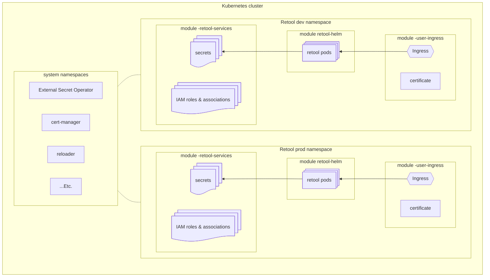

# Deploying into a shared / existing Kubernetes cluster

The `*_all_inclusive` examples stand up a dedicated cluster from scratch. This
guide covers deploying Retool into a cluster you do **not** exclusively own —
e.g. an existing EKS/GKE/AKS cluster shared with other workloads. All three
clouds support this.

Working starting points:
- [`examples/aws_shared_cluster`](../examples/aws_shared_cluster)
- [`examples/gcp_shared_cluster`](../examples/gcp_shared_cluster)
- [`examples/azure_shared_cluster`](../examples/azure_shared_cluster)

The mechanics are the same on all three clouds and the variable names are
common unless noted; where a cloud genuinely differs, it gets its own block.
`<cloud>` below stands for `aws`, `gcp` or `azure`, and the cluster module means
`aws-eks`, `gcp-gke` or `azure-aks`.

## Deploying Retool into an existing Kubernetes cluster

The `<cloud>-retool-services`, and `<cloud>-user-ingress` modules each depend on some operators to be already running in the cluster. To use those modules with an existing Kubernetes cluster, you'll need to also use the relevant Kubernetes module (i.e. `aws-eks`, `gcp-gke`, or `azure-aks`) with an `existing_cluster = {...}` input to deploy whichever operators your cluster doesn't already have.

| Operator | AWS | GCP | Azure |
|---|---|---|---|
| External Secrets Operator | ✅ | ✅ | ✅ |
| reloader | ✅ | ✅ | ✅ |
| cert-manager | ✅ | — | ✅ |
| AWS Load Balancer Controller | ✅ | — | — |

<details>
<summary>Preparing an AWS EKS cluster</summary>

```hcl
module "eks" {
  source = "tryretool/self-hosted-blueprints/retool//modules/aws-eks"

  prefix = local.prefix
  region = local.region

  existing_cluster = {
    name                   = "my-shared-eks"
    node_security_group_id = "sg-0123456789"
  }

  # Karpenter is wired to the controller node group this module creates
  # with a new cluster, so it cannot run against an adopted one.
  enable_karpenter = false
}
```
</details>

<details>
<summary>Preparing a GCP GKE cluster</summary>

```hcl
module "gke" {
  source = "tryretool/self-hosted-blueprints/retool//modules/gcp-gke"

  prefix     = local.prefix
  project_id = local.project_id
  region     = local.region

  existing_cluster = {
    name     = "my-shared-gke"
    location = local.region
  }
}
```

The adopted cluster must have Workload Identity enabled, and the Gateway API
enabled if you use `gcp-user-ingress`. Both are checked at plan time.
</details>

<details>
<summary>Preparing an Azure AKS cluster</summary>

```hcl
module "aks" {
  source = "tryretool/self-hosted-blueprints/retool//modules/azure-aks"

  prefix              = local.prefix
  resource_group_name = local.resource_group_name
  location            = local.location

  existing_cluster = {
    name = "my-shared-aks"
  }
}
```

The adopted cluster must have `oidc_issuer_enabled` and
`workload_identity_enabled` set — every identity Retool creates federates
against that issuer.
</details>

Every addon and chart the cluster module installs has an enable toggle,
all defaulting `true`, so a cluster that already runs one can be adopted without
a second copy fighting over it. 

| Variable | AWS (`aws-eks`) | GCP (`gcp-gke`) | Azure (`azure-aks`) |
| --- | :-: | :-: | :-: |
| `enable_external_secrets` | ✅ | ✅ | ✅ |
| `enable_reloader` | ✅ | ✅ | ✅ |
| `install_crds` | ✅ | ✅ | ✅ |
| `enable_cert_manager` | ✅ | — | ✅ |
| `enable_alb_controller` | ✅ | — | — |
| `enable_karpenter` | ✅ | — | — |
| `enable_metrics_server` | ✅ | — | — |
| `enable_ebs_csi_driver` | ✅ | — | — |
| `enable_coredns_addon` | ✅ | — | — |
| `enable_kube_proxy_addon` | ✅ | — | — |
| `enable_vpc_cni_addon` | ✅ | — | — |
| `enable_pod_identity_agent` | ✅ | — | — |

> [!WARNING]
> For any cloud, but especially for AWS EKS, other blueprints modules might
> throw errors or might not work properly if the operators are configured any
> differently than they would be if managed by the cluster blueprints module
> (i.e. `aws-eks`). Please refer to [module source code](../modules/) for full
> configuration details to make your own assessment.

### Secrets store authorization

There is one External Secrets Operator for the whole cluster, but each Retool
deployment keeps its own cloud identity, so one deployment can never read
another's secrets.

The shape is the same everywhere: `<cloud>-retool-services` creates a
per-deployment identity granted access to just that deployment's secrets, and
the deployment's namespaced `SecretStore` names it. The shared controller then
assumes that identity for that store rather than using its own. What differs is
the mechanism.

<details>
<summary>AWS — the store names an IAM role</summary>

`<prefix>-eso` is an IAM role scoped to this deployment's Secrets Manager paths.
Its trust policy admits the cluster ESO controller's role, and the `SecretStore`
sets `spec.provider.aws.role` to it.

If your platform team runs ESO, set `eso_controller_role_arns` on
`aws-retool-services` to the IAM role its controller pods use. Across accounts
that role also needs an identity policy allowing `sts:AssumeRole` on
`module.retool-services.outputs.eso_role_arn`; within one account the trust
policy alone is sufficient.

By default the controller may assume any role in the account whose name ends in
`-eso`. Override `external_secrets_assumable_role_arns` on `aws-eks` to narrow
that.
</details>

<details>
<summary>GCP — the store names a Kubernetes service account</summary>

`<prefix>-eso` is a Google service account holding
`roles/secretmanager.secretAccessor` on this deployment's secrets individually —
no project-level grant. A Kubernetes service account `retool-eso` in
`<prefix>-retool` is annotated with it and bound through Workload Identity, and
the `SecretStore` sets `spec.provider.gcpsm.auth.workloadIdentity.serviceAccountRef`
to that service account.

If your platform team runs ESO, bind its controller to
`module.retool-services.outputs.eso_gcp_service_account_email`, or copy the
per-secret IAM grants onto whatever identity it uses.
</details>

<details>
<summary>Azure — the store names a Kubernetes service account</summary>

`<prefix>-eso-identity` is a user-assigned managed identity with a Key Vault
access policy granting `Get`/`List`. A Kubernetes service account `retool-eso`
in `<prefix>-retool` carries its client ID, a federated credential trusts that
service account's subject, and the `SecretStore` sets
`spec.provider.azurekv.serviceAccountRef` to it.

If your platform team runs ESO, federate an additional credential on
`module.retool-services.outputs.eso_identity_client_id` for its controller's
service account, or grant its identity the same Key Vault access policy.
</details>

`create_external_secrets` on `<cloud>-retool-services` still controls whether the
`SecretStore` and `ExternalSecret` objects are created at all, independently of
who runs the operator.

## Deploying multiple Retool instances in one Kubernetes cluster

Multiple Retool instances can coexist in one Kubernetes cluster using these blueprints modules. At a high level, some cluster-level operators will be deployed as singletons to static namespaces, and other resources will be deployed into a Retool instance namespace, once per instance.

This diagram illustrates what a cluster would contain with 2 separate Retool instances, a `dev` and a `prod`.



To deploy multiple Retool instances into a single Kubernetes cluster, some
Terraform modules will be instantiated once total (i.e. `Shared: Yes` below), and some modules will be instantiated once per Retool instance (i.e. `Shared: No` below).

| Module | Shared | Notes |
|---|---|---|
| `aws-vpc`/`gcp-vpc`/`azure-vnet` | Yes | |
| `aws-eks`/`gcp-gke`/`azure-aks` | Yes | |
| `<cloud>-database` | Optional | See [sharing a Postgres DB instance](#sharing-a-postgres-db-instance) below |
| `<cloud>-retool-services` | No | |
| `<cloud>-user-ingress` | No | |
| `retool-helm` | No | |

To properly configure the Terraform modules in a shared-cluster setting, you will need to specify unique module names and `prefix` parameters for each per-Retool-instance module, as well as ensure cross-module output references use the correct module dependency.

The configuration below is an example illustrating one common scenario that
accounts for all of the above. Here, we are pretending to be a company named
`acme` and we are creating 2 separate Retool instances, `myretool-dev` and
`myretool-prod`, to live in a shared AWS EKS cluster and each use a separate RDS
Postgres database. These code snippets only show the parts that are relevant to
making the shared-cluster setup work.

**shared.tf**
```terraform
locals {
  # ...
  prefix_global = "acme-myretool"
}

module "vpc" {
  # ...
  prefix = local.prefix_global
}

module "eks" {
  # ...
  prefix = local.prefix_global
}
```

**myretool-dev.tf**
```terraform
locals { 
  dev = {
    prefix = "${local.prefix_global}-dev"
    domain_name = "myretool-dev.acme.org"
  }
}

module "db-main-dev" {
  # ...
  prefix = local.dev.prefix
}

module "retool-services-dev" {
  # ...
  prefix = local.dev.prefix
  
  eks = module.eks.outputs
  db = module.db-main-dev.outputs
}

module "retool-dev" {
  # ...
  domain_name = local.dev.domain_name
  retool_services = module.retool-services-dev.outputs
  db = module.db-main-dev.outputs
}

module "user-ingress-dev" {
  # ...
  domain_name = local.dev.domain_name
}
```

**myretool-prod.tf**
```terraform
locals {
  prod = {
    prefix = "${local.prefix_global}-prod"
    domain_name = "myretool.acme.org"
  }
}

module "db-main-prod" {
  # ...
  prefix = local.prod.prefix
}

module "retool-services-prod" {
  # ...
  prefix = local.prod.prefix
  
  eks = module.eks.outputs
  db = module.db-main-prod.outputs
}

module "retool-prod" {
  # ...
  domain_name = local.dev.domain_name
  retool_services = module.retool-services-prod.outputs
  db = module.db-main-prod.outputs
}

module "user-ingress-prod" {
  # ...
  domain_name = local.prod.domain_name
}
```

### Sharing a Postgres DB instance

#### Tradeoffs

When deploying multiple Retool instances into a single Kubernetes cluster, you
have the choice of sharing a single Postgres DB for all Retool instances, or
running a dedicated Postgres DB for each instance. The high level tradeoffs are
below.

| Factor                        | Shared DB                 | Per-instance DB                  |
|-------------------------------|---------------------------|----------------------------------|
| Cost                          | :white_check_mark: Lowest | :warning: Moderate–High          |
| Resource exhaustion tolerance | :warning: Lowest          | :white_check_mark: High          |
| Reliability                   | :warning: Lowest          | :white_check_mark: High          |
| Manual setup                  | :warning: Some required   | :white_check_mark: None required |

Besides the above tradeoffs, running multiple Retool instances off a single
Postgres DB instance is fully supported if adequately setup.

#### Configuration

For the sake of illustration, say your goal is to create 2 separate Retool
instances, a "dev" and "prod" pair, and you want them to share a Kubernetes
cluster and a Postgres DB instance to minimize costs.

To accomplish this, you'll need to follow these steps, explained in detail below:

1. Create 2 databases within your Postgres DB instance, 1 for each Retool
   instance
2. Arrange your Terraform code so that each Retool instance uses the same
   Postgres host and connection credentials but only uses its corresponding
   database within the host.

#### 1. Creating per-instance databases inside the Postgres DB instance

Terraform cannot usually manage the data inside your Postgres instance, so you'll have to get a psql shell into your instance to manually create a database for each deployment sharing the instance.

If you have `kubectl` configured with a local kubeconfig profile to access your Kubernetes cluster, you can create a temporary pod with `psql` installed using the below command. This is often convenient, if possible, since your Postgres instance is usually not not accessible externally but is accessible to pods in your cluster.

```sh
kubectl run db-surgery-tmp --image=postgres:latest -it --rm --restart=Never -- sh
```

You'll need to plug in your Postgres host, admin user, and password in order for `psql` to successfully connect.

Once in a `psql` shell, you can create a database for each Retool deployment you wish to support like so.

```sql
CREATE DATABASE "retool-acme-dev";
CREATE DATABASE "retool-acme-prod";
```

#### 2. Duplicating Retool instances to share a Postgres host

The `<cloud>-retool-services` and `retool-helm` modules usually expect an input
variable like `db = module.db-main.outputs`. This `db` input contains structured
connection settings that tell the downstream `<cloud>-retool-services` and
`retool-helm` modules where to find and how to connect to their database.

In the case of multiple Retool instances sharing a single Postgres instance, we
need to have each Retool instance use mostly the same shared connection settings
(i.e. host, port, username, password stored in the CSP's secure secret store),
but with an override for database name. We can accomplish that with a config
arranged like below.

```terraform
locals {
  # ...
  prefix_global = "acme"
  
  dev = {
    prefix = "acme-dev"
    db_outputs = merge(module.db-main.outputs, {
      name = "retool-acme-dev"
    })
  }
  
  prod = {
    prefix = "acme-prod"
    db_outputs = merge(module.db-main.outputs, {
      name = "retool-acme-prod"
    })
  }
}

module "db-main" {
  # ...
  prefix = local.prefix_global
}

# repeat this whole module for -dev and -prod both
module "retool-services-dev" {
  # ...
  prefix = local.dev.prefix
  db = local.dev.db_outputs
}

# repeat this whole module for -dev and -prod both
module "retool-dev" {
  # ...
  retool_services = module.retool-services-dev.outputs
  db = local.dev.db_outputs
}
```

> [!NOTE]  
> The above snippet does not show how your `<cloud>-vpc`/`<cloud>-vnet` module,
> your managed Kubernetes module, nor your `<cloud>-user-ingress` module should
> be configured with this setup. Your vpc/vnet module and Kubernetes modules
> would use the `local.prefix_global` shown here, like `db-main` does. Your
> `<cloud>-user-ingress` module would be duplicated for each Retool instance,
> like `retool-dev` shown here, and would use a per-instance domain name, but it
> does not need a `db` input.


## Other considerations

### Namespace selection

Each Retool instance gets a single dedicated namespace, and all per-Retool-instance Kubernetes resources live in that namespace. By default, the `<cloud>-retool-services` module creates that namespace and uses the name `<prefix>-retool`. 

To use a different name, you can specify `retool_namespace = "..."` on the `<cloud>-retool-services` module. The specified namespace gets passed down to `retool-helm` and `<cloud>-user-ingress` modules via module outputs, so you only need to specify it once.

If your cluster already has the namespace you want to use, you can tell `<cloud>-retool-services` to use it via a combination of `retool_namespace = "..."` and `create_namespace = false`.

### Pinning pods to node pools

A shared cluster often has dedicated node pools for different workloads,
labelled and/or tainted so only intended workloads land there. For Retool's pods
to schedule onto such a pool, they need a matching `nodeSelector` and/or
`tolerations`.

Every module that deploys pods via Helm exposes two variables for this: the
cluster module (`aws-eks` / `gcp-gke` / `azure-aks`, for the cluster-wide
operators), `retool-helm` (Retool itself), and `gcp-user-ingress` /
`azure-user-ingress` (external-dns and AGIC). `aws-user-ingress` deploys no pods
and has neither variable.

- `pod_node_selector` (`map(string)`, default `{}`)
- `pod_tolerations` (list of Kubernetes toleration objects, default `[]`)

They apply to **every** pod the module's charts create. Set the same values on
each module you deploy so the whole stack lands on the pool:

```hcl
locals {
  # ...
  pod_node_selector = { "retool.com/pool" = "retool" }
  pod_tolerations = [{
    key      = "dedicated"
    operator = "Equal"
    value    = "retool"
    effect   = "NoSchedule"
  }]
}

module "eks" {
  # ...
  pod_node_selector = local.pod_node_selector
  pod_tolerations   = local.pod_tolerations
}

module "retool" {
  # ...
  pod_node_selector = local.pod_node_selector
  pod_tolerations   = local.pod_tolerations
}
```

Leave them unset (the default) to keep the charts' own defaults. Note that when
set, `pod_node_selector` replaces a chart's built-in `nodeSelector` default
where one exists (e.g. cert-manager defaults to `kubernetes.io/os: linux`);
include any such keys you still need in your map.
